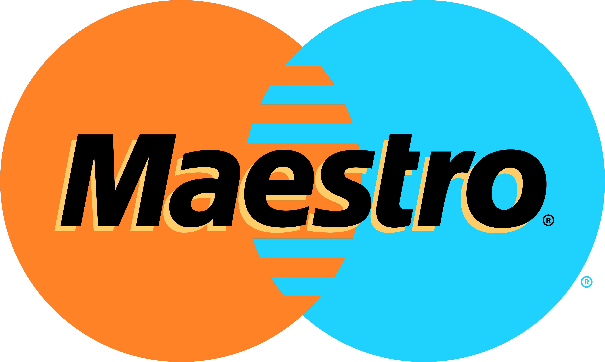
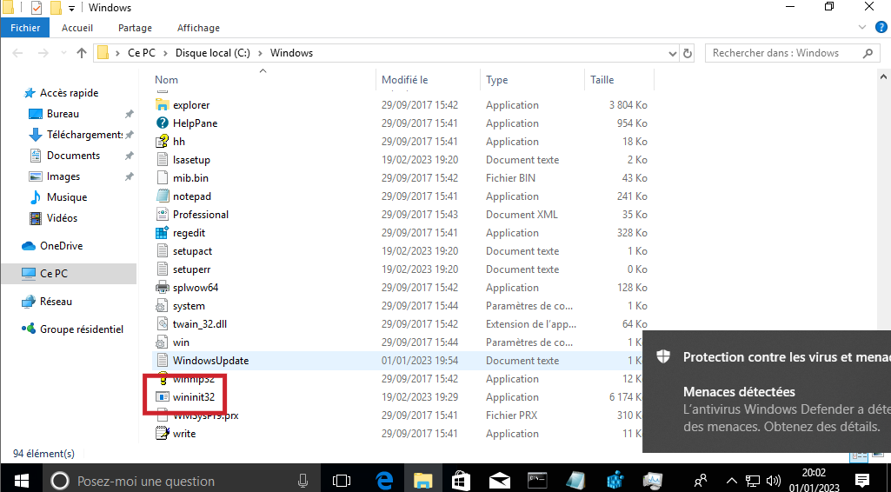

# Note
Will soon drop support for systems that use Windows 8.1 and earlier (the custom BSOD does not work in these versions)

# Maestro Trojan (aka trojan.win32.clubette)
trojan virus, not the waifu please end my life
Made using VBS and Batch

# READ THIS LINE OF TEXT OR DIE
Yes I made this, but if you decide to use it maliciously, it's YOUR PROBLEM

I HOPE YOU DIDN'T SHARE THIS TO YOUR HORNY FRIEND, YOUR LITTLE BROTHER, PUTIN, OR ANYONE ELSE WITHOUT EXPLICITLY LETTING THEM KNOW THIS CAN DAMAGE YOUR COMPUTER

Please, RUN THIS UNDER A VIRTUAL MACHINE : https://virtualbox.org

# Building this
You'll need Bat2Exe to convert it into a full exe
LINK: https://www.majorgeeks.com/files/details/bat_to_exe_converter.html
You must add everything (except the start folder) into mainfile.bat/embed option
You must add stuff in start folder into start.bat/embed option
Then click convert and u have a "sample"

# THE PAYLOADS
1st january - fun with windows (changes window transparency - cmd/regedit/ie/explorer)

6th february - spam taskill + start explorer & canadian eas

25th june - Crappy fred durst message (can't do anything + lags pc)

1st september - BACKFLIP VIDEO FULL SCREEN LOOP

11th september - changes bg to 9-11

1st october - changes start page to a website opens iexplore & spams lol tts

14th december - popups (click = MBR OVERWRITE + BSOD)

31st december - fun

